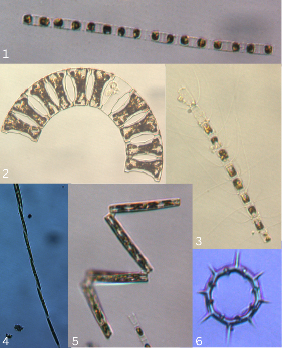

```{r setup, include=FALSE}
library(rmdformats)
knitr::opts_chunk$set(echo = FALSE, warning = FALSE, message = FALSE)
```

```{r, echo=FALSE, out.width="150%"}

options(repos = list(CRAN = "http://cran/rstudio.com/"))

```

<hr>
## **Background** 
<hr>

Phytoplankton are photosynthetic organisms that live within the water column. These microscopic organisms are primary producers in the aquatic food chain, making them a keystone species in both freshwater and marine ecosystems. They play a critical role in aquatic habitats by fixing carbon dioxide and producing organic materials that larger organisms in the food chain consume in large abundance. However, too much phytoplankton in the water can indicate eutrophication, the process caused by nutrient over-enrichment. Large populations of phytoplankton are referred to as blooming events or algal blooms. The die-off of phytoplankton within large scale blooms depletes a water body of dissolved oxygen, stunting the survivability of aquatic species within that ecosystem. Certain species of phytoplankton also produce harmful toxins, such as dinoflagellates which cause red tide events. Eutrophication, the excess input of nutrients through human sources to a water body, is the primary contributor to algal blooming events. Contributors to eutrophication in nearshore waters are typically in the form of wastewater from sewage treatment plants, as well as excess fertilizer and agricultural runoff. 

Since 1991, the [Connecticut Department of Energy and Environmental Protection (CT DEEP)](https://portal.ct.gov/DEEP/Water/LIS-Monitoring/LIS-Water-Quality-and-Hypoxia-Monitoring-Program-Overview) has conducted an intensive water quality monitoring program on LIS (LIS). The program is funded through a grant from the U.S. Environmental Protection Agency's (EPA) [LIS Partnership](https://lispartnership.org/). Data from these surveys are used to quantify and identify annual trends and differences in water quality parameters and characterize phytoplankton blooms. These data are used to evaluate the effectiveness of the LIS water quality management programs' efforts to reduce nutrient inputs with emphasis on nitrogen, as nitrogen is a primary contributor to excessive algae growth in LIS.  

During the spring of 2024 (January through April), surveys were conducted across LIS at monthly intervals to monitor the extent and duration of phytoplankton blooms. Surveys included sample collection of dissolved oxygen, temperature, salinity, nutrients and chlorophyll at 17 sites (Figure 1). A subset of 10 stations were also sampled for phytoplankton community composition (Figure 7).    

```{r, fig.cap = '<i> Click on the interactive map above to explore the average chlorophyll (ppb) per sample station in LIS for the spirng 2024 sampling season (Feb-Apr). Colors indicate critical threshold levels of chlorophyll-a designated by the EcoHealth Report Card system used by Save the Sound where chlorophyll-a levels of <5.6 ppb are shown in blue, 7.0-8.2 ppb in yellow, and >8.2 ppb in red. </i>'}

library(leaflet)
library(sf)
library(htmltools)
library(dplyr)
library(tidyr)
library(lubridate)
library(RColorBrewer)
library(ggplot2)
library(gridExtra)
library(scales)
library(ggh4x)


#Chlorophyll Data for Map 
survey_chlorophyll <- read.csv("Data/LIS2024_spring_chl_sampled.csv",  header = TRUE, na.strings=c("-9999",""))

chlorophyll_spring_average <- survey_chlorophyll  %>% 
  select(Station.Name, Result, Latitude, Longitude) %>% 
  group_by(Station.Name) %>%
  summarize(Average_chl = mean(Result, na.rm = TRUE)) %>%
  mutate_if(is.numeric, round, 2)


#Station Locations
DEEP_sample_stations <- read.csv("Data/awX_stations.csv", header = TRUE)
LIS_sample_stations <- DEEP_sample_stations[3100:3116,c(1,2,3,4,5)]

station_coords <- LIS_sample_stations %>% select(WaterbodyName, ylat, xlong) %>% rename(Station.Name = WaterbodyName) 

#Binding tables to add coords to chl data
spring_avg_chl_map_data <- merge(station_coords, chlorophyll_spring_average, by= "Station.Name", all.x = T)

report_card_pal <- colorBin(palette = c("#0072BC","#FDB515","red3"), bins = c(0,5.6,7.0,8.2,15))
  
#Mapping
survey_map <-leaflet(width = "100%") %>% 
  addProviderTiles(providers$CartoDB.PositronNoLabels) %>% 
  setView(lng = -72.799, lat = 41.126, zoom = 9) %>%   
  addCircleMarkers(data= spring_avg_chl_map_data,  
                  lng= ~xlong,
                  lat= ~ylat, 
                  radius = ~rescale(Average_chl, c(10,24)),
                  stroke = FALSE, 
                  fillOpacity = 0.5,
                  #color = ~ifelse(spring_avg_chl_map_data$Average_chl>7, "#FDB515","#0072BC"), #Brand Standard Colors Yellow > 7.0, Blue < 5.6
                  color = ~report_card_pal(Average_chl),
                  popup=~paste("<br> Station ", spring_avg_chl_map_data$Station.Name,
                            "<br>Average Chlorophylla (ppb) for spring 2024:", spring_avg_chl_map_data$Average_chl))

survey_map
```
</br> 


<hr>
## **LIS Chlorophyll Survey Results **
<hr>

Phytoplankton blooms are often brought on by the excessive input of nitrogen and phosphorus to an aquatic ecosystem. In marine ecosystems, nitrogen is the primary contributor to increased algal growth. Phytoplankton feed off the nutrient input and reproduce leading to rapid population growth over a short period of time. Algal blooms themselves can be harmful to aquatic life and human health due to toxins produced by certain species; however, the aftermath of large algal blooms are also harmful to aquatic ecosystems. The rapid population growth of phytoplankton species leads to the depletion of nutrients and a large-scale decline in population size as the phytoplankton die due to lack of available food. During these die-off events dead phytoplankton will decompose with the assistance of oxygen consuming bacteria. This process depletes the water column of dissolved oxygen leading to hypoxia, or low oxygen conditions. Motile organisms will then leave these hypoxic areas, if possible, but often sessile organisms die in these low oxygen environments.   

The amount, or biomass, of phytoplankton present is important to understanding their function in a system, and is often estimated by measuring the amount of chlorophyll. The LIS Partnership uses chlorophyll a thresholds as part of the [Eco Health Report Card for LIS](https://ecoreportcard.org/report-cards/long-island-sound/indicators/chlorophyll-a/) to indicate the health of LIS. The Report Card grades LIS chlorophyll-a concentrations across a range from A to F. Healthy conditions receive an "A" grade while poor conditions receive an "F" grade. The thresholds for LIS are as follows: Grade A < 5.6 ppb, grade B 5.6- 6.2 ppb, grade C 6.2- 7.0 pbb, D 7.0- 8.2 , and grade F > 8.2 pbb. Below are time series videos comparing surface chlorophyll concentrations in LIS from the spring 2003 survey season and the spring 2024 survey season. The maps displayed in this time series were created using spatial interpolations of chlorophyll samples taken from 17 sample stations across LISon a monthly basis. In spring 2003, the majority of LIS was in the F range during the first sampled period (January 28th- February 14th), with a bloom extending from the western basin. Over the rest of the spring 2003 season (March-April) chlorophyll concentrations decreased across the majority of the Sound resulting in most areas being classified in the A range.  Concentrations in the western basin, however, remained elevated resulting in the basin falling in the F range for the entire season. In contrast, during the spring of 2024, the majority of the Sound remained in the healthy A range for the entire spring sampling season.  

</br>


<video width="100%" controls>
  <source src="images/new_Spring2003_chlorophyll_map.mp4" type="video/mp4">
</video>

</br>

<video width="100%" controls>
  <source src="images/new_Spring2024_chlorophyll_map.mp4" type="video/mp4">
</video>

</br>

The Spring 2003 sampling season had higher concentrations of chlorophyll-a across a larger area of LIS than the 2024 spring sampling season. Higher concentrations of chlorophyll-a are typically equivalent to larger concentrations of plankton biomass which, during their decomposition process, contribute to large hypoxic areas. The higher concentrations of chlorophyll-a across surface waters in LIS in spring 2003 gave rise to a maximum hypoxic area of 894 sq km in the summer of 2003. In comparison, the lower concentrations observed in the 2024 spring sampling season,coupled with other climatic factors, led to a maximum hypoxic area of only 112.4 sq km the following summer. Although phytoplankton are naturally occurring, population surges typically stem from anthropogenic influences and occur in areas with less circulation. This pattern is observed in LIS with algal blooms typically starting in the Western Narrows by New York City, a heavily populated region of the Sound, and stretching eastward. 

Globally, 2003 had more precipitation than previous years, while also being one of the hottest years on record (Global Change Data Lab 2025). Increased precipitation contributes to greater rates of nutrient input to waterways via runoff and leads to increased algal growth in tidal estuaries like LIS. Warmer temperatures also increase algal growth as it alters the metabolic balance of marine ecosystems in favor of higher productivity (Yvon-Durocher et al 2010). Therefore, the combination of warmer years with higher annual rates of precipitation increases the chances of larger algal blooms. Although 2024 was the warmest year to date, and witnessed a 7 percent increase in precipitation within the United States from 2003 (Global Change Data Lab 2025), implementation of key environmental policies may have assisted in limiting the extent of hypoxia and size of algal blooms across LIS (Connecticut Sea Grant 2019). One of these polices is the [Total Maximum Daily Load to Achieve Water Quality Standards for Dissolved Oxygen in LIS (TMDL)](https://neiwpcc.org/our-programs/pollution-control/lis-tmdl/). Adopted in 2000, the TMDL established a 58% nitrogen reduction target for the Sound. The CT Nitrogen Credit Exchange Program, [CT's Second Generation Nitrogen Strategy](https://portal.ct.gov/deep/water/lis-monitoring/lis-hypoxia-and-nitrogen-reduction-efforts), [EPA's Nitrogen Reduction Strategy for LIS](https://longislandsoundstudy.net/our-vision-and-plan/clean-waters-and-healthy-watersheds/nitrogen-strategy/), and [NY's Long Island Nitrogen Action Plan](https://dec.ny.gov/nature/waterbodies/oceans-estuaries/long-island-watershed-program/linap) are some of the initiatives developed to advance implementation of the TMDL and nitrogen reductions. 

```{r, out.width="100%", fig.cap = '<i> Spring seasonal averages of chlorophyll-a by year for all of LIS. A decreasing linear model is displayed in red.  </i>'}

##install.packages(plotly)
library(plotly)

#Bar plot of spring chlorophyll average for all of LIS by year 
#Add trend line

chlorophyll_2003_2024 <- read.csv("data/2003_2024_chlorophyll.csv", header = TRUE, na.strings = c("", NA, "-999"))

#chlorophyll_2003_2024$Year <- format(as.Date(chlorophyll_2003_2024$Date, format = "%d/%m/%Y"), "%Y")

#chlorophyll_2003_2024$Date <- as.Date(chlorophyll_2003_2024$Date, format = "%d/%m/%Y")

#chlorophyll_2003_2024$Year <- year(chlorophyll_2003_2024$Date)

chlorophyll_2003_2024_spring <- chlorophyll_2003_2024 %>% 
  filter(Month == c("JAN", "FEB", "MAR", "APR")) %>% 
  mutate(Date = dmy(Date),
         Year = year(Date))%>%
  group_by(Year) %>%
  summarize(Average_yearly_chl= mean(Result, na.rm = TRUE)) %>%
  mutate_if(is.numeric,round, 2)

chl_spring23_24 <-ggplot(chlorophyll_2003_2024_spring, aes(x= Year, y= Average_yearly_chl)) +
  geom_bar(stat = "identity", fill = "#0072BC") +
  geom_smooth(aes(group = 1), method = "lm", se= FALSE, color = "red")+ #Can comment out linear model trend line here
  labs(
    title = "Spring Seasonal Average Chlorophyll-a by Year Across LIS, 2003-2024",
    x = "Year",
    y = "Average Chlorophyll-a (mg/m³)")+
  ylim(0,12)+
  theme_minimal() +
  theme(plot.title = element_text(hjust = 0.5, face = "bold"))
#axis.text.x = element_text(angle = 45, hjust = 1))

ggplotly(chl_spring23_24)

```

<hr>
## **Remote Sensing in LIS**
<hr>

[NOAA CoastWatch](https://coastwatch.noaa.gov/cwn/index.html) is a platform created by the National Oceanic and Atmospheric Administration (NOAA) to help people access and use satellite observations for ocean, coastal, and inland water applications (National Oceanic and Atmospheric Administration 2025). Using remote sensing data from the Coastwatch data portal, a time series of water quality parameters can be constructed with a greater frequency of information over a large spatial area than with water quality measurements alone. However, it is important to combine satellite water quality observations with water quality surveys for a more accurate and detailed analysis of a water body: where satellite images can expand the study area, in-person water quality samples provide a way to ground truth satellite observations.  

The graph below uses data from Sentinel 3 OLCI provided by NOAA CoastWatch (Figure 3). A CoastWatch compatible algorithm was developed specifically for chlorophyll in LIS by the [Tzortziou Bio-Optics Lab](TZORTZIOU BIO-OPTICS LAB - Home) at the City College of New York. The [LIS Ocean Color Data Portal](https://www.lisoceancolor.org/) provides information on the project and LIS specific satellite images.     

```{r, out.width="100%", fig.cap = '<i> Time series graph of satellite observed chlorophyll concentrations at sample stations in LIS during the 2024 spring survey season. </i>'}

#Chlorophyll concentrations are averaged together based on the sample station's location in either the western, central, or eastern basin to achieve one value per basin for each week of the spring survey season. 

#Load Data 
observed_chl <- read.csv("data/Weekly_chl_observations_spring2024.csv", header = TRUE, na.strings="-9999")

#Group Data by Station 
observed_chl_by_basin <- observed_chl %>%
  mutate(
    Basin = case_when(
      Sttn_Nm %in% c("09","15","A4","B3","C1", "C2","D3","E1") ~ "Western",
      Sttn_Nm %in% c("F2","F3", "H2","H4","H6") ~ "Central",
      Sttn_Nm %in% c("I2","J2","K2","M3") ~ "Eastern"))


#Reshaping to long format 
observed_chl_by_basin_long <- observed_chl_by_basin %>% 
  pivot_longer( 
    cols=starts_with("Chl_"),
    names_to = "Week",
    values_to = "Chlorophyll") %>% 
  mutate(Week = as.Date(gsub("Chl_", "", Week), format = "%b_%d"))

#Averaging Chlorophyll by Basin 
avg_observed_chl_by_basin_long <- observed_chl_by_basin_long %>% 
  group_by(Week, Basin) %>% 
  summarise(Mean_Chlorophyll = mean(Chlorophyll, na.rm = TRUE), .groups = "drop") 

#Plotting 
avg_obs_basin_long <- ggplot(avg_observed_chl_by_basin_long, aes (x= Week, y = Mean_Chlorophyll, color =Basin)) + 
  geom_line(size=1) +
  ylim(0,10) +
  labs( 
    title = "Average Satellite Observed Chlorophyll-a by Basin in LIS, Jan-Apr 2024",
    x= "Week", 
    y= "Mean Chlorophyll-a (mg/m^3)") + 
  scale_color_manual(values =c("Eastern" = "#0D2D6C", "Central" = "#0072BC", "Western" = "#68CEF2")) + #Primary and secondary brand standard colors
  theme_minimal() + 
   theme(
    plot.title = element_text(hjust = 0.5, face = "bold"), 
    legend.position = "right")+ 
  theme(axis.title.y= element_text(margin =margin (r=10)))

ggplotly(avg_obs_basin_long)
```

To create a time series by basin, the sample stations established by CT DEEP’s LIS Water Quality Monitoring Program (Figure 1) were divided into three regions. The Western Basin comprises eight stations (09, 15, A4, B3, C1, C2, D3, and E1), the Central Basin comprises five stations (F2, F3, H2, H4, and H6), and the Eastern Basins comprises four stations (I2, J2, K2, and M3). Stations within each of the three basins were then averaged together respectively to create a singular averaged chlorophyll-a value per basin for each week of available satellite data. Broken down by sample station, and averaged across the 2024 sampling season, satellite observed chlorophyll-a concentrations follow similar trends to sampled data, with most observed chlorophyll-a values only within a singular value difference from the sampled chlorophyll concentrations per station (Figure 5).  

Between January and May 2024, satellite imagery observed higher chlorophyll-a concentrations in the Western Basin of LIS than either the Eastern or Central basins, with the exception of one week in late January where the Central Basin had slightly higher observed values than the Western Basin (Figure 3). These observations are consistent with sample data collected by CT DEEP for the spring 2024 season. In both the sampled and satellite observed data, the Western Basin of LIS is identified as a higher probability area for algal blooms. 

```{r, out.width="100%", fig.cap = '<i> Satellite observed chlorphyll-a concentrations by station in LIS during the spring 2024 survey season. </i>'}

ggplot(observed_chl_by_basin_long, aes(x = Week, y = Chlorophyll)) +
  geom_line(size = 1, alpha = 0.7, color = "#0D2D6c") + 
  facet_wrap(~ Sttn_Nm, scales = "fixed") + 
  labs(
    title = "Satellite Observed Chlorophyll-a by Station in LIS, January-April 2024",
    x = "Month",
    y = "Chlorophyll-a (mg/m^3)"
  ) +
  theme_minimal() +
  theme(plot.title = element_text(hjust = 0.5, face = "bold"), axis.title.y= element_text(margin =margin (r=10)))
```

Similar to the averaged chlorophyll concentrations by basin (Figure 3), satellite observed chlorophyll separated by station (Figure 4) also displays an increase in concentrations during the month of February for most individual stations. These satellite observations are corroborated with in situ data which also shows higher chlorophyll concentrations in LIS during the month of February, particularly in the Western and Central Basins as shown in the previous 2024 spatial interpolation animation video.  

</br>

```{r, out.width="100%", fig.cap = '<i> Average satelitte observed chlorophyll-a concentrations versus in situ sampled chlorophyll concentrations per sample station in LIS across the spring 2024 survey season. </i>'}
#Load Sampled Data 
Sampled_monthly_chl <-read.csv("Data/LIS2024_spring_chl_sampled.csv", header=TRUE)


#Average Observed and Sampled Data by Station Respectively 
observed_chl_station_avg <- observed_chl_by_basin_long %>%
  group_by(Sttn_Nm) %>%
   mutate(Station = as.factor(Sttn_Nm)) %>%
  summarise(Average_Chlorophyll_Observed = mean(Chlorophyll, na.rm = TRUE), .groups = "drop")

sampled_chl_station_avg <- Sampled_monthly_chl %>% 
  group_by(Station.Name) %>%
  mutate(Station = as.factor(Station.Name)) %>%
  summarise (Average_Chlorophyll_Sampled = mean(Result, na.rm = TRUE, .groups = "drop")) 

observed_sampled_chl <- left_join(observed_chl_station_avg, sampled_chl_station_avg, by = c("Sttn_Nm" ="Station.Name"))

observed_sampled_chl <- observed_sampled_chl %>%
  rename(Sampled = Average_Chlorophyll_Sampled, Observed = Average_Chlorophyll_Observed)

observed_sampled_chl_long <- observed_sampled_chl %>%
  pivot_longer(cols = c(Sampled, Observed), names_to = "Type", values_to = "Average")


#Sorting Stations in Basins 
bar_plot_data <- observed_sampled_chl_long %>%
mutate(Basin = case_when(
      Sttn_Nm %in% c("09","15","A4","B3","C1", "C2","D3","E1") ~ "Western",
      Sttn_Nm %in% c("F2","F3", "H2","H4","H6") ~ "Central",
      Sttn_Nm %in% c("I2","J2","K2","M3") ~ "Eastern"))

#Creating Station Order 
bar_plot_data$Sttn_Nm <- factor(observed_sampled_chl_long$Sttn_Nm, levels= c("A4", "B3", "C1", "C2", "D3", "09", "E1", "15", "F2", "F3", "H2", "H4", "H6", "I2", "J2", "K2", "M3"))

bar_plot_data$Basin <- factor(bar_plot_data$Basin, levels = c("Western", "Central", "Eastern"))
#bar_plot_data$Sttn_nm <- factor(bar_plot_data$Sttn_Nm, levels = unique(bar_plot_data$Sttn_Nm)) # ordered west to east

# Combine Basin and Station for unique x-axis value
#bar_plot_data$Axis_group <- paste(bar_plot_data$Basin, bar_plot_data$Sttn_Nm, sep = "_")

#Creating nested x-axis factor 
#bar_plot_data$nested_x <- interaction(bar_plot_data$Sttn_Nm, bar_plot_data$Basin, lex.order = TRUE)


#This one has the lines that show which basin each station falls into but adds a different title at the bottom and changes theme :(
ggplot(bar_plot_data, aes(x = interaction(Sttn_Nm, Basin), y = Average, fill = Type)) +
  geom_bar(stat = "identity", position = "dodge") +
  scale_fill_manual(values = c("#68CEF2", "#0D2D6C")) +
  labs(
    title = " Averaged Chlorophyll-a Values by Station, January - April 2024",
    x = "Stations by Basin in LIS",
    y = "Average Chlorophyll-a (mg/m³)",
    fill = "Data Type") +
  ylim(0,15)+
  theme_light() + 
  scale_x_discrete(guide = "axis_nested")+
  theme(plot.title = element_text(hjust = 0.5, face = "bold"))

```

When compared, in-situ sampled chlorophyll concentrations generally follow the same pattern as the concentrations derived from satellite imagery per station (Figure 5). Station A4 shows the most variability between sampled and observed values, likely because this station sees the greatest fluctuations in chlorophyll concentration over the survey season due to its proximity to New York City, and the lack of incoming tidal currents to dilute nutrient input. The differences between sampled and observed values likely stem from the difference in sampling frequency. While satellite data was observed daily and averaged over two-week intervals, in-situ chlorophyll samples were collected once a month over a three-day period.  

</br>

<hr>
## **Phytoplankton in Long Island Sound** 
<hr>

Phytoplankton are critical to the health of marine ecosystems. As autotrophic organisms, phytoplankton form the base of the aquatic food web while also producing a large portion of Earth's oxygen, regulating ocean nutrient cycles, and assisting in the removal of carbon dioxide from the atmosphere (Suthers et al 2019). Phytoplankton have been compared to canaries in the coal mine in terms of their sensitivity to environmental changes. This high sensitivity to change allows researchers to identify the health of the water body based on phytoplankton diversity and abundance (Suthers et al 2019). Phytoplankton in nutrient saturated waters typically display a rapid increase in population growth. Rapid population growth can be one indicator of heavy nutrient input. This pattern is commonly reflected in the Western Basin of LIS during the spring and summer, where productivity rates increase with the warming season leading to greater inputs of nutrients from the land.  

Phytoplankton samples are collected at 10 stations across the Sound by CTDEEP. Sample processing and species counts/identification are conducted by the [Lin Lab](https://phytoplankton.uconn.edu/) at the University of Connecticut Avery Point.


The interactive map below shows phytoplankton abundance by station across LIS. Samples were collected between late January and early April 2024 to summarize the 2024 spring survey season.  Click each station to view counts (cells per liter). 
 

```{r,fig.cap = '<i> Phytoplankton abundance per sample station in LIS during the Spring 2024 sampling season. </i>'}
#Load Data
Plankton <- read.csv("Data/Phytoplankton_average_abundance_Jan_Apr.csv", header = TRUE, na.strings = "")

#Mapping
Plankton_map <- leaflet(width="100%") %>%
  addProviderTiles(providers$CartoDB.PositronNoLabels) %>% #Background map 
  setView(lng = -72.799, lat = 41.126, zoom = 9) %>% #Central focused area
  addCircleMarkers(
    data = Plankton,
    radius= ~ rescale(Average_abundance, c(10,24)),
    stroke = FALSE, fillOpacity = 0.5,
    lat = ~xlat,
    lng = ~ylong,
    color = "#23AE49", #Primary brand standard color "Electric Green"
    popup = ~paste0("<br> Station Name: ", Plankton$Stations,
      "<br>Average Abundance (Cell count/L): ", Plankton$Average_abundance))


Plankton_map
```

The phytoplankton community in LIS is composed mostly of Diatoms (Figures 7 and 8). Diatoms, one of the major species groups of phytoplankton, are silica-based micro-algae that can be found in marine, freshwater, and even within the soils of terrestrial ecosystems. This particular species of algae commonly dominates estuarine ecosystems, like LIS, due to their wide range in salinity tolerance, ability to use silica which is often abundant in these ecosystems, and the high nutrient availability of estuaries.  

```{r, out.width="100%", fig.cap = '<i> Cell counts of phytoplankton categorized by major groups per month at each sampleing station across LIS from January and February 2024. </i>'}
#Prevents Scientific Notation 
options(scipen = 999)

#Reading Data 
cell_count_surface_phytoplankton <- read.csv("data/surface_cell_count_phytoplankton.csv", header = FALSE, na.strings= c("", NA))

#A4, All Months, Surface Vs Bottom 
Stations <- cell_count_surface_phytoplankton[1,-1] #1st row is stations names, mins first column
Months <- cell_count_surface_phytoplankton[2,-1]   #2nd row is months names, mins first column

cell_count_surface_phytoplankton <- cell_count_surface_phytoplankton[-c(1,2), ] #Removes first two rows

colnames(cell_count_surface_phytoplankton) <- c("Species", paste(Stations, Months, sep="_")) #Creating unique column names

surface_cell_count_phytoplankton_long <- cell_count_surface_phytoplankton %>%
  pivot_longer(cols= -Species, names_to = "Station_Month", values_to= "Cell_Count") %>%
  separate(Station_Month, into= c("Station", "Month"), sep= "_", extra= "merge") %>%
  mutate(Cell_Count= as.numeric(Cell_Count))

#Stations & Months List 
#stations_list <- unique(surface_cell_count_phytoplankton_long$Station)
months_list <- unique(surface_cell_count_phytoplankton_long$Month)

#Spring_surface_plankton_data <- surface_cell_count_phytoplankton_long %>% 
  #filter(Month == c("Jan", "Feb", "Mar", "Apr"))

#Vector of Spring Months 
spr_m1 <- c("Jan", "Feb")
spr_m2 <- c("Mar", "Apr")

Spring_surface_plankton_data1 <- surface_cell_count_phytoplankton_long[surface_cell_count_phytoplankton_long$Month %in% spr_m1,]
Spring_surface_plankton_data1$Month_Name <- factor(Spring_surface_plankton_data1$Month, levels = month.abb, labels = month.name)

Spring_surface_plankton_data2 <- surface_cell_count_phytoplankton_long[surface_cell_count_phytoplankton_long$Month %in% spr_m2,]
Spring_surface_plankton_data2$Month_Name <- factor(Spring_surface_plankton_data2$Month, levels = month.abb, labels = month.name)

#Jan-Feb Plot (Figure 7)
 Jan_Feb <- ggplot(Spring_surface_plankton_data1, aes(x= Station, y= Cell_Count, fill = Species))+
      geom_bar(stat="Identity", position= "stack")+
      ggtitle(paste("Surface Phytoplankton in LIS, Spring 2024"))+
      xlab("Sample Stations")+
      ylab("Cell Counts per Liter")+
      #ylim(0,11000000)+
      facet_wrap(~Month_Name)+
      theme_minimal()+
      theme(axis.title.y=element_text(margin=margin(r=10)))

ggplotly (Jan_Feb)
```

```{r, out.width="100%", fig.cap = '<i> Cell counts of phytoplankton categorized by major groups per month at each sampleing station across LIS from March and April 2024. </i>'}
#March - April phytoplankton cell count plot (Figure 8) 
Mar_Apr <- ggplot(Spring_surface_plankton_data2, aes(x= Station, y= Cell_Count, fill = Species))+
      geom_bar(stat="Identity", position= "stack")+
      ggtitle(paste("Surface Phytoplankton in LIS, Spring 2024"))+
      xlab("Sample Stations")+
      ylab("Cell Counts per Liter")+
      #ylim(0,11000000)+
      facet_wrap(~Month_Name)+
      theme_minimal()+
      theme(axis.title.y=element_text(margin=margin(r=10)))

ggplotly (Mar_Apr)
```
<br>

Although Diatoms dominate the spring phytoplankton assemblage in LIS, they can often be out competed by other species including Dinoflagellates in the summer months, as shown in August in the plot below (Figure 9). This may be due in part to the stratification of the water column over the summer months which can trap phytoplankton at different depths with varying degrees of nutrient availability and light penetration. Dinoflagellates have the competitive advantage of being both autotrophic and heterotrophic, meaning they are able to absorb organic matter or engulf prey in addition to photosynthesizing. Diatoms are primarily autotrophic and rely on photosynthesis for nutrition.  

```{r, out.width="100%", fig.cap = '<i> Surface phytoplankton relative abundance plots per station in LIS from January to October 2024. </i>'}
#Reading in Data Frame
surface_phytoplankton <- read.csv("Data/surface_phytoplankton_rel_abund_2024_no_nanoplankton.csv", header= TRUE, na.strings= c("", NA))

#Transforming Data to "Long" for Plotting
surface_phytoplankton_long <- gather(surface_phytoplankton, Species, Abundance, Diatom:Small_Flagellates)

#Cleaning/Orangizing Data 
Surface_phytoplankton_plotting_data <- surface_phytoplankton_long %>% mutate(Species = case_when(Species == "Small_Flagellates" ~ "Small Flagellate", TRUE ~ Species))
Surface_phytoplankton_plotting_data$Month <- factor(Surface_phytoplankton_plotting_data$Month, levels= month.abb)

#Plotting 
Surf_plank_2024 <- ggplot(Surface_phytoplankton_plotting_data, aes(x= Month, y= Abundance, fill= Species)) +
  geom_bar(stat= "Identity")+ 
  #scale_x_discrete(limits= month.abb)+
  xlab("Survey Month") +
  ylab("Relative Abundance")+
  ggtitle("Relative Abundance of Surface Phytoplankton in LIS, Jan-Oct 2024")+
  theme_minimal()+
  theme(axis.title.y=element_text(margin=margin(r=10)))

ggplotly (Surf_plank_2024)
```

Aside from Diatoms and Dinoflagellates, other common species groups found in LIS over the course of 2024 included Cryptophytes, Prasinophytes, and Ochrophytes (Figure 8). While the majority of Cryptophytes, Prasinophytes, and Ochrophytes are autotrophes, there are some species with each group that are considered mixotrophic, meaning they can switch between autotrophic and heterotrophic states to survive in nutrient poor environments. It is likely these mixotrophic species within each group are responsible for the increase in group relative abundance during the summer months of 2024 (Figure 10).   

Pictured below are examples of phytoplankton species identified in-house by the Connecticut Department of Energy and Environmental Protection Water Quality Monitoring Team including *Eucampia zodiacus* belonging to the Diatom group (Figure 10.2) and *Dictyocha spp.* (Figure 10.6) falling under the Silicoflagellates group. 

```{r, fig.align= "center", out.height= "50%", out.width= "50%", fig.cap = '<i>Phytoplankton found in LIS 1)Skeletonema spp. 2)Eucampia zodiacus 3)Chaetoceros spp. 4)Nitzschia longissima 5)Thalassionema nitzschioides 6)Dictyocha spp. Identification completed by Connecticut Department of Energy and Environmental Protection LIS Water Monitoring Team. </i>'}



```

</br>

The most common species across all sample locations for the 2024 spring survey season were *Skeletonema spp.*, *Eucampia zodiacus*, and *Guinardia delicatula* (Figure 11).   

</br>

```{r,out.width="100%", fig.cap = '<i> Graph of phytoplankton species abundance from 30 samples (from 10 sample sites) collected over the spring 2024 survey season in LIS. </i>'}

#Prevents Scientific Notation 
options(scipen = 999)

plankton_raw_table <- read.csv("Data/plankton_abundance2024.csv", header= TRUE, na.strings= c("-999", "NA", "-"))

#Cleaning Data (Removing and merging certain rows)
#Removing Rows 
#plankton_raw_table <- plankton_raw_table[-c(221,222), ]

#Average plankton counts 
averaged_plankton_table <- plankton_raw_table %>%
  rowwise() %>%
  mutate(
    A4_avg = mean(c_across(starts_with("A4")), na.rm = TRUE),
    B3_avg = mean(c_across(starts_with("B3")), na.rm = TRUE),
    C1_avg = mean(c_across(starts_with("C1")), na.rm = TRUE),
    D3_avg = mean(c_across(starts_with("D3")), na.rm = TRUE),
    E1_avg = mean(c_across(starts_with("E1")), na.rm = TRUE),
    F2_avg = mean(c_across(starts_with("F2")), na.rm = TRUE),
    H4_avg = mean(c_across(starts_with("H4")), na.rm = TRUE),
    I2_avg = mean(c_across(starts_with("I2")), na.rm = TRUE),
    J2_avg = mean(c_across(starts_with("J2")), na.rm = TRUE),
    K2_avg = mean(c_across(starts_with("K2")), na.rm = TRUE)
  ) %>%
  ungroup()


#Calculate average abundance across all columns, exclude species with no data
species_abundance2024 <- plankton_raw_table %>%
  rowwise() %>%
  mutate(Avg_Abundance = mean(c_across(-SampleID), na.rm = TRUE)) %>%
  ungroup() %>%
  filter(!is.na(Avg_Abundance)) %>%  #Filters out species with no data
  arrange(desc(Avg_Abundance)) %>%
  slice_head(n = 10) #Filters for the top 10 greatest


#Plotting
ggplot(species_abundance2024, aes(x = reorder(SampleID, -Avg_Abundance), y = Avg_Abundance)) +
  geom_bar(stat = "identity", fill = "#00AAE7") + #Brand standard color "Clear Blue"
  ylim(0, 1200000) +
  labs(title= "Phytoplankton Species Abundance in LIS, Jan-Apr 2024", x = "Phytoplankton Species 2024", y="Average Cell Abundance") +
  theme_minimal() +
  theme(axis.text.x = element_text(angle = 45, hjust = 1))


```

</br>

The phytoplankton species displayed above (Figure 11) are the ten species with the greatest average abundance from samples collected over the spring 2024 survey season. Out of all phytoplankton species found in LIS during the spring survey period. *Skeletonema spp.* are commonly the most abundant species in estuarine ecosystems as they prefer brackish waters and have a wide range in salinity tolerance (Balzano et al 2011). The broad salinity tolerance of *Skeletonema spp.* make LIS an ideal location for this species due to the frequent fluctuations in salinity based on season and location within the sound, a factor that inhibits more salinity sensitive species from thriving in the same environment. *Skeletonema spp.* also have the competitive advantage of a resting stage, where this species can survive in the bottom sediment of a waterbody during adverse conditions and resume growth as conditions become more favorable (Gu et al 2012). Spring and autumn blooms of *Skeletonema spp.* are associated with high partial pressure of dissolved carbon dioxide, a leading cause of ocean acidification. Ocean acidification has been shown to alleviate the negative effects of low temperatures and daylight conditions on the growth rate of *Skeletonema costatum*, assisting species growth earlier in the spring season as acidification increases (Li et al 2021). 
 
</br>

<hr>
## **Contact Information**
<hr>

**For more information on the LIS Water Quality Monitoring Program visit:**

<a href="https://portal.ct.gov/DEEP/Water/LIS-Monitoring/LIS-Water-Quality-and-Hypoxia-Monitoring-Program-Overview"></a>

<!-- [**CT DEEP LIS Monitoring Program**](https://portal.ct.gov/DEEP/Water/LIS-Monitoring/LIS-Water-Quality-and-Hypoxia-Monitoring-Program-Overview)   -->

<a href="https://www.iec-nynjct.org/programs/water/sound-monitoring"></a> 

<!-- [**Interstate Environmental Commision**](https://www.iec-nynjct.org/programs/water/sound-monitoring) -->

<a href="https://longislandsoundstudy.net/"></a>

<!-- [**LIS Partnership**](https://lispartnership.org/) -->

[**LISICOS**](https://lisicos.uconn.edu/index.php)


**Acknowledgements:**<br>
Cover photo: Sydney Peacock, 2024/2025 LIS Seasonal Research Assistant.

This Project was funded by the United States Environmental Protection Agency, LIS Partnership through grant funds administered by CT DEEP and IEC.  

Report prepared by Sydney Peacock and Katie Clayton-O'Brien. For more information on this report contact Katie O'Brien-Clayton(katie.obrien-clayton@ct.gov). 

<hr>
## **References** 
<hr>

Balzano, S., Sarno, D., and Kooistra, W. (2011). Effects of Salinity on the Growth Rate and Morphology of Ten Skeletonema Strains. Journal of Plankton Research.33:6:937-945. 

Connecticut Sea Grant. (2019). A Healthier LIS: Nitrogen Pollution. University of Connecticut. 

Ferrara, G. (2020). Dinoflagellates Important Marine Producers of Natural Bio-Compounds with High Biotechnological and Pharmacological Potential. Journa of Food Chemistry and Nanotechnology. 6(3),138-149. https://foodchemistryjournal.com/2020/07/15/dinoflagellates-important-marine-producers-of-natural-bio-compounds-with-high-biotechnological-and-pharmacological-potential/

Global Change Data Lab. (2025). Annual Precipitation. Our World Data. https://ourworldindata.org/grapher/average-precipitation-per-year?tab=table&time=1987..2003

Gu, H., Zhang, X., Sun, J., and Luo, Z. (2012). Diversity and Seasonal Occurrence of Skeletonema (Bacillariophyta) Species in Xiamen Harbour and Surrounding Seas, China. Cyrptogamie, Algologie. 33(3),245-263.Retrieved March 18, 2025 from https://sciencepress.mnhn.fr/sites/default/files/articles/pdf/cryptogamie-algologie2013v33f3a29.pdf

Li, H., Xu, T., Li, F., and Xu, J. (2021). Physiological response of Skeletonema costatum to the interactions of seawater acidification and the combination of photoperiod and temperature. Bigeosciences. 18(4),1439-1449. 

National Oceanic and Atmospheric Administration.(2025). NOAA CoastWatch Program. NOAA CoastWatch. https://coastwatch.noaa.gov/cwn/about/noaa-coastwatch-program.html#:~:text=NOAA%20CoastWatch%20connects%20people%20and,ecosystems%2C%20weather%2C%20and%20climate.

Peacock, E., Olson, R. and Sosik, M. (2014). Parasitic Infection of the Diatom Guinarida delicatula, a recurrent and ecologically important phenomenon on the New England Shelf. Marine Ecology Progress Series. 503:1-10.  

Stroermer, E. F. and Julius, M. L. (2003). Freshwater Algae of North America. (pp. 559-594). Academic Press. 

Suthers, I., Rissik, D., & Richardson, A. (2019). Plankton: A Guide to Their Ecology and Monitoring for Water Quality. CRC Press. 

University of Maryland Center for Environmental Science Integration and Application Network. (2025). LIS. Eco Health Report Cards. https://ecoreportcard.org/report-cards/long-island-sound/indicators/chlorophyll-a/

Yvon-Durocher, G., Jones, J. I., Trimmer, M., Woodward, G., & Montoya, J. M. (2010, July 12). Warming alters the metabolic balance of ecosystems.  Philosophical Transactions of the Royal Society B. Biological Sciences. 365,2117-2126. 